### <sub>Key</sub>{sto}<sub>ne(.js)</sub>{ne}<sub>xt(.js)Pro</sub>{xy}


<p align="center">
  <sup><sub>🦄 PLEASE REMEMBER TO SMASH THE ⭐🔨 BUTTON AND <a href="https://github.com/sponsors/donspablo/dashboard">SUPPORT</a> 🌈 THANK YOU.</sub></sup>
</p>
<p align="center">
  📢<sup><sub><i><b> YOUR SUPPORT IS GREATLY APPRECIATED / </b> <a href="https://www.patreon.com/donPabloNow">PATREON.COM/DONPABLONOW</a> / <b>BTC</b> 3HVNOVVMLHVEWQLSCCQX9DUA26P5PRCTNQ / <b>ETH</b> 0X3D288C7A673501294C9289C6FC42480A2EA61417 </i></sub></sup>
</p>


<p align="center"></img></p>

| <p align="center"></img></p><sub><sup><a href="https://github.com/4dboard/Proxy-yxorP">YXORP PROXY</a>: Web Proxy 🐮 yxorP: SAAS(y) Guzzler + App (GUI Dashboard incl.). Feature Rich, Multi-tenancy, Headless, Plug & Play, Augmentation & Content Spinning Web Proxy with Caching - PHP CURL+Composer are Optional. Leveraging SAAS architecture to provide multi-tenancy, multiple threads, caching, and an article spinner service.</sub></sup> | <p align="center"></img></p><sub><sup><a href="https://github.com/meanos/meanOs">MEANOS</a>: The operating system with the smallest memory footprint and the highest performance levels. NEW RELEASE A new version of the Web3 operating system will be released in the near future. https://mean.ơs.com. Operating systems have been subjected to significant revisions; if you would want to be informed when the subsequent version is made available, please subscribe.</sub></sup> |
|------------------------------------------------------------------------------------------------------------------------------------------------------------------------------------------------------------------------------------------------------------------------------------------------------------------------------------------------------------------------------------------------------------------------------------------------------------------------------------------------------------------------------------------------------------------------------------|------------------------------------------------------------------------------------------------------------------------------------------------------------------------------------------------------------------------------------------------------------------------------------------------------------------------------------------------------------------------------------------------------------------------------------------------------------------------------------------------------------------------------------------------------------------------------------------------------------------------|


<p align="center"></p>
<p align="center"><a href="https://github.com/donspablo/stonexy/actions/workflows/pages/pages-build-deployment"></a> <a href="https://app.netlify.com/sites/freegamesonline/deploys"></a> <a href="https://vercelbadge.vercel.app/api/donspablo/stonexy"></a> <a href="https://github.com/donspablo/stonexy/actions/workflows/nextjs.yml"></a></p>

# <sub>Key</sub>{sto}<sub>ne(.js)</sub>{ne}<sub>xt(.js)Pro</sub>{xy} | STO-NE-XY

## Stonexy is a node.js based Web-proxy and Mirroring CMS

### Unleash the Magic of Effortless and Powerful Proxying, Mirroring, and Reflecting

#### Powered by a Stunning and User-Friendly Node.js CMS with Keystone.js, GraphQL, Typescript, and Middleware

Welcome to Stonexy, the remarkable GitHub repository that hosts a cutting-edge SAAS-based platform specifically designed
for website mirroring. With Stonexy, you can effortlessly mirror some of the web's coolest sites like Google, Wikipedia,
Twitter, and Instagram, all with the grace of a dancing unicorn. This powerful platform, built with Typescript and
powered by the Next.js framework, harnesses the extraordinary capabilities of Keystone.js CMS and GraphQL to deliver a
seamless and user-friendly experience.

Stonexy takes website mirroring to new heights by offering an efficient http-proxy-middleware, ensuring lag-free
performance. It also embraces worldwide fame with CDN support that serves hot statistical resources faster than a
speeding bullet. The integration of Keystone.js CMS elevates the platform, providing a dynamic and intuitive graphical
user interface that leaves no stone unturned.

However, Stonexy is not solely focused on website mirroring. It offers a comprehensive solution for website development
as well. Whether you're creating a robust website mirroring solution or a groundbreaking SAAS-based platform, Stonexy
serves as a steadfast foundation to realize your aspirations. By seamlessly combining the strengths of Next.js,
Keystone.js, and GraphQL, Stonexy empowers you to optimize performance, enhance security, handle dynamic text
seamlessly, and deliver an exceptional audio and video streaming experience.

Setting up Stonexy is a breeze. Simply follow the expert instructions provided, and you'll be able to create a web
proxy, mirror any desired website, and deploy it on Vercel. If you're looking to take it a step further, you can
register your own domain name and perform real-name registration, configuring your custom domain to seamlessly work with
Stonexy.

Join us on this incredible journey with Stonexy and unlock the full potential of your projects. Say goodbye to the
complexities of website mirroring and development, and embrace the power and versatility that Stonexy brings to the
table. Get ready to conquer the web with Stonexy: your all-in-one, humorous, and mind-bending solution.

For a comprehensive overview of additional features, please click the following link to unveil the full range of
capabilities and functionalities offered by Stonexy:

<details>
  <summary>Click here to reveal more features</summary>

    🦄: Mirror any website effortlessly with our versatile, compatible, and secure solution. Whether it's Google, Wikipedia,
    Twitter, or Instagram, our comprehensive platform ensures seamless mirroring. Handle complex websites with ease, thanks
    to our ready-to-use functions and continuous feature enhancements tailored for specific sites. Effortless website
    mirroring has never been this versatile, compatible, and secure.
    
    🚀: Boost your website's performance with Stonexy's local file caching. By utilizing MIME-based caching, you can
    maximize your bandwidth and minimize latency, especially in scenarios where bandwidth is limited or latency is high
    between the mirror server and your site. It's the ideal solution to optimize performance and deliver a lightning-fast
    user experience.
    
    ⚡: Supercharge your text delivery with Stonexy's CDN support. Harness the power of a Content Delivery Network
    to enhance user access speed. Serve up those hot statistical resources with lightning-fast efficiency, even if your
    mirror server is located abroad. With CDN support, your text will be delivered quickly and seamlessly, ensuring an
    exceptional user experience no matter where your visitors are located.
    
    👽: Say goodbye to complex configuration and deployment woes! With Stonexy, setting up your website is a breeze.
    Simply add your website's domain name, and our solution takes care of the rest. We've streamlined the entire process to
    provide you with a hassle-free experience. Enjoy the simplicity and ease of use as you effortlessly configure and deploy
    your website with Stonexy.
    
    🌈: Take control of your website's security with Stonexy's customizable measures. Safeguard your text by
    implementing IP or user-agent-based access control and visitor verification mechanisms. Enhance security even further
    with question-answer or custom verification functions, providing an additional layer of protection. With Stonexy,
    you have the flexibility to tailor the security measures to fit your specific needs, ensuring peace of mind and
    safeguarding your website against unauthorized access.
    
    ☄️: Experience seamless handling of dynamic text with Stonexy. Our solution effortlessly rewrites JSON,
    JavaScript, HTML, CSS, and dynamic URLs, ensuring flawless compatibility and accurate rendering of even the most complex
    text. Say goodbye to compatibility issues and hello to a smooth user experience as Stonexy seamlessly handles
    and processes dynamic text, making sure it looks and functions as intended. Sit back and let Stonexy take care
    of the intricacies, while you enjoy flawless delivery of your dynamic text.
    
    👾: Indulge in the ultimate audio and video streaming experience with Stonexy. Say goodbye to buffering and
    interruptions as you enjoy uninterrupted playback of your favorite audio and video text. Our solution offers
    comprehensive support for streaming image, ensuring a seamless user experience on your mirrored website. From
    captivating music to stunning videos, Stonexy ensures that your audience can enjoy a smooth and immersive audio
    and video streaming experience like never before. Sit back, relax, and let the smooth streaming begin.
    <hr />  

</details> 

Explore the extensive array of advanced tools and enhancements designed to elevate your website mirroring experience to
new heights. Uncover the power and versatility that Stonexy brings to the table, empowering you with a myriad of options
to optimize performance, enhance security, handle dynamic text seamlessly, and deliver an exceptional audio and video
streaming experience. Don't miss out on discovering the full potential of Stonexy.

# Stonexy Setup


Stonexy is a powerful tool that enables you to create a web proxy, mirror a desired website, and domain the
application on Vercel. By following these expert instructions, you can set up Stonexy and deploy it on Vercel:

1. Create a Next.js Project:
    - Set up a new Next.js project or use an existing one. Ensure you have Next.js installed globally or within your
      project.

2. Install Dependencies:
    - Open your project directory in a terminal or command prompt.
    - Run the following command to install the necessary dependencies:
      ```
      npm install http-proxy-middleware next
      ```

3. Configure the Proxy:
    - Within your Next.js project, create a new directory named `api`.
    - Inside the `api` directory, create a file named `proxy.cts`.
    - In `proxy.cts`, import the required modules:
      ```javascript
      const { createProxyMiddleware } = require('http-proxy-middleware');
      const { NextApiHandler } = require('next');
      ```

    - Implement the proxy configuration and create a Next.js API route handler:
      ```javascript
      const targetHost = 'https://example.com'; // Replace with your desired website URL
 
      const proxy = createProxyMiddleware({
        target: targetHost,
        changeOrigin: true,
      });
 
      const handler = (req, res) => {
        proxy(req, res);
      };
 
      export default handler;
      ```

4. Deploy on Vercel:
    - Commit your changes to a version control system (e.g., Git).
    - Connect your Next.js project to a Git repository, such as GitHub or GitLab, using the Vercel dashboard.
    - Configure the deployment settings, such as the branch to deploy and the build command (typically `npm run build`).
    - Once configured, deploy your Next.js project on Vercel by initiating the deployment process.

5. Verify and Use the Proxy:
    - Once the deployment is successful, Vercel will provide you with a unique URL for your application.
    - Access the deployed application and append `/api/proxy` to the URL (
      e.g., `https://your-vercel-project.vercel.app/api/proxy`).
    - This will act as the proxy endpoint, mirroring the desired website specified in the `targetHost` variable.

By following these expert instructions, you can leverage Stonexy to create a web proxy and domain the application
on
Vercel. This allows you to mirror a desired website while utilizing the power and scalability of the Vercel hosting
platform.


# 1. Forking the Repository:

- Navigate to the repository you wish to fork on the hosting platform (e.g., GitHub).
- Click on the "Fork" button located in the top right corner of the repository's page.
- Wait for the platform to create a copy of the repository under your account. Once the process is complete, you will be
  redirected to the forked repository.

# 2. Rewriting the Target Host Name in api/proxy.cts:

- Locate the api/proxy.cts file within the forked repository's directory structure.
- Open the proxy.cts file using a suitable code editor.
- Look for a variable or constant that defines the target domain name, typically named targetHost or something similar.
- Modify the assigned value of the target domain name to the desired value. In this case, replace "google.com" with the
  desired domain name.
- Save the changes made to the proxy.cts file.

You will now have successfully forked the repository and rewritten the target domain name in the api/proxy.cts file.
These actions allow you to create your own copy of the repository and customize the target domain to suit your needs.

```js
const {createProxyMiddleware} = require("http-proxy-middleware");

module.exports = (req, res) => {
    let target = "https://www.google.com/";//your website url
    //   if (
    //     req.url.startsWith("/api") ||
    //     req.url.startsWith("/auth") ||
    //     req.url.startsWith("/banner") ||
    //     req.url.startsWith("/CollegeTask")
    //   ) {
    //     target = "http://106.15.2.32:6969";
    //   }

    createProxyMiddleware({
        target,
        changeOrigin: true,
        pathRewrite: {
            // rewrite request path `/backend`
            //  /backend/user/login => https://google.com/user/login
            //   "^/backend/": "/",
        },
    })(req, res);
};

```

# 3. Registering Your Vercel Account:

- Visit the official Vercel website at vercel.com.
- On the homepage, locate the "Sign Up" or "Get Started" button and click on it.
- Fill in the required information in the registration form, including your name, email address, and a secure password.
- Optionally, you may have the option to sign up using an existing GitHub, GitLab, or Bitbucket account for convenience.
- Complete any additional verification steps, if prompted.
- Once the registration process is complete, you will have successfully created your Vercel account.
- Binding Your GitHub Account in Vercel's Settings:

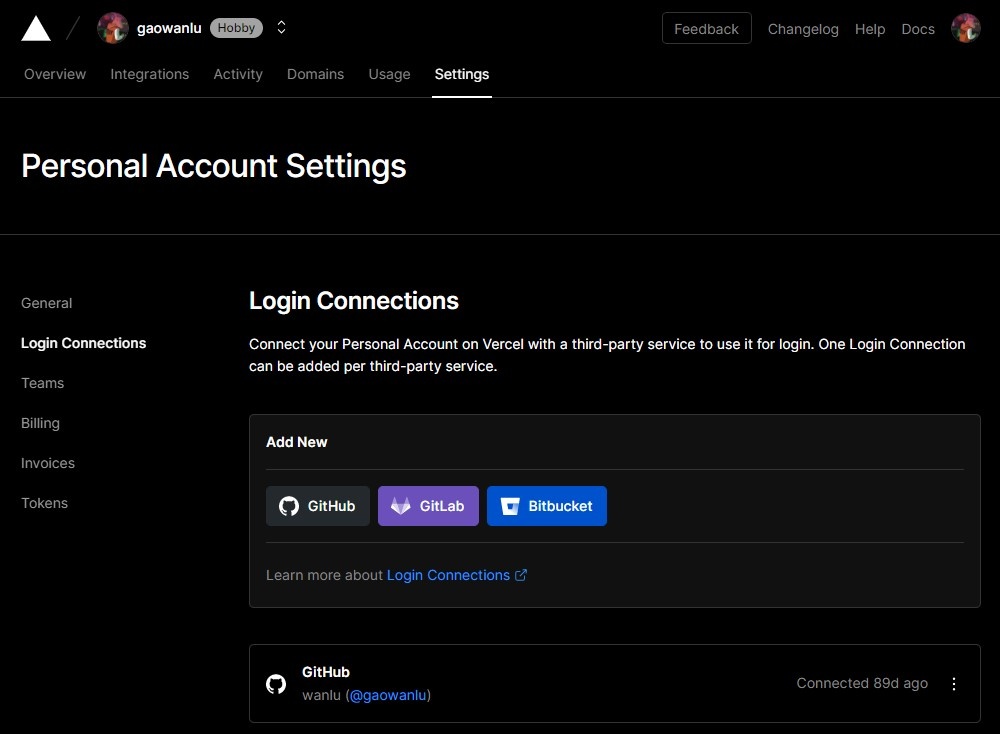

# 4. Log in to your Vercel account using your registered credentials.

- Once logged in, you will be directed to the Vercel dashboard.
- Locate the user settings section, often accessible through an avatar or user icon in the top right corner of the
  dashboard.
- Click on the user settings to access your account settings.
- Within the account settings, look for an option to "Connect" or "Link" your GitHub account.
- Click on this option and follow the prompts to authorize Vercel's integration with your GitHub account.
- You may be asked to provide GitHub credentials and grant permission to Vercel.
- Once the integration is successfully established, you will see a confirmation message or a connected GitHub icon in
  your Vercel account settings.

You will have registered a Vercel account and successfully bound your GitHub account to your Vercel settings.
This integration allows you to seamlessly connect your GitHub repositories to Vercel's deployment platform for
streamlined deployment and hosting processes.

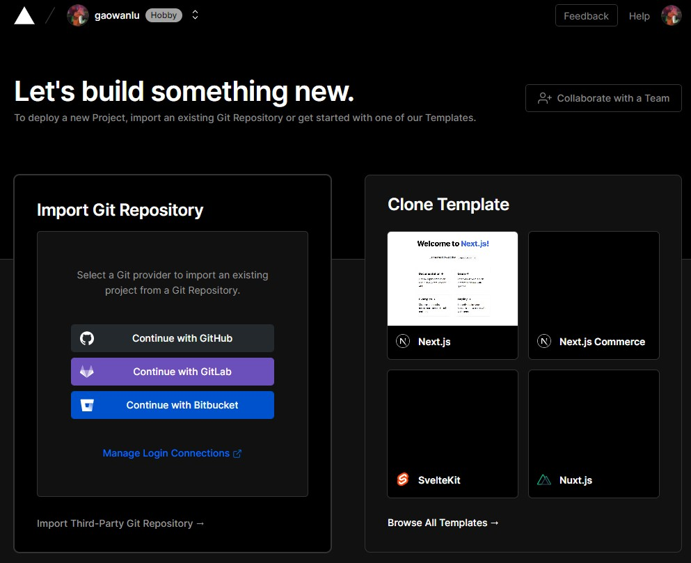

# 6. Adding a New Project:

- On the Vercel dashboard, locate the "Add" or "Create" button, typically found on the top right corner of the page.
  Click on it.
- A dropdown menu will appear with various options. Select "Import Project" or a similar option that indicates importing
  from a Git repository.

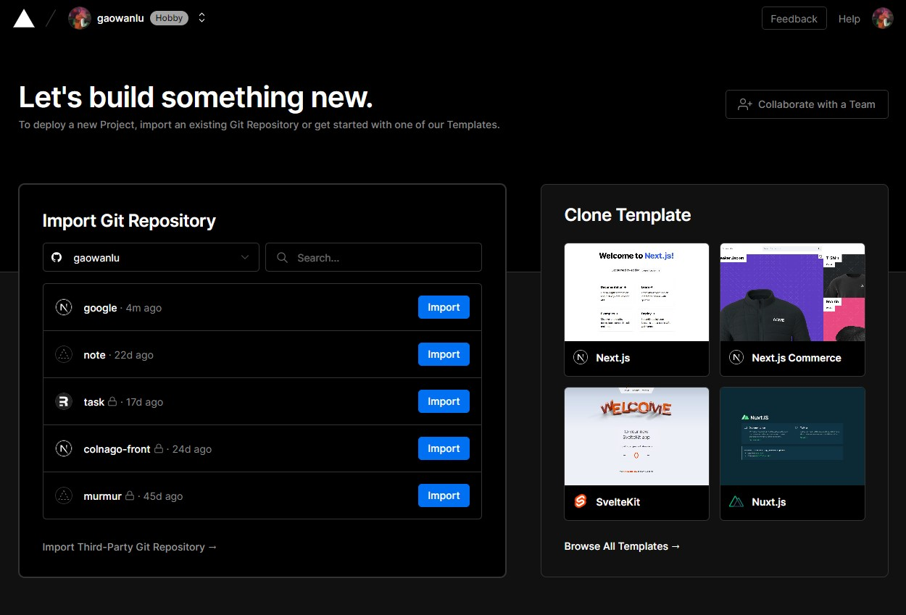

# 7. Importing from a Git Repository:

- After selecting the import option, you will be presented with a form or dialog box requesting details about your Git
  repository.
- In this form, you'll be prompted to specify the URL or repository location of your Git project.
- Enter the URL or repository location in the designated field. It should be the address of the Git repository you want
  to import.
- Verify that the repository URL is correct, as any inaccuracies may cause issues with the import process.
- Once you've filled in the necessary details, click on the "Import" or "Add Project" button to initiate the import
  process.


# 8. Project Configuration:

- Vercel will begin the process of importing your Git repository. It may take a few moments to analyze the repository
  and set up the project.
- During the import process, Vercel may prompt you to configure certain settings for your project, such as the
  deployment target or build commands. Follow the provided instructions to customize these settings as desired.
- After the configuration process is complete, Vercel will generate a preview of your project's deployment settings. You
  can review and adjust these settings if needed.

You will be able to import your Git repository into Vercel by accessing the "Add New Project" or "Import Project" option
from the Vercel dashboard's overview section.
This allows you to seamlessly connect your Git repository to Vercel and leverage its powerful deployment and hosting
capabilities for your project.

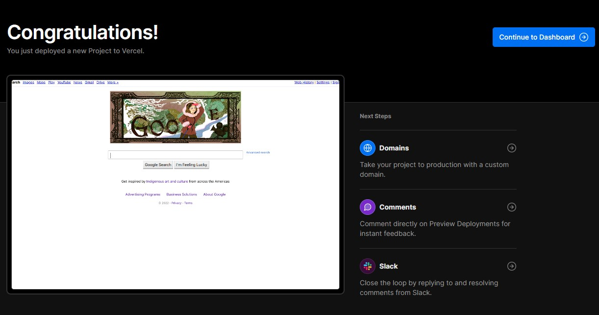

# 9. Registering Your Own Domain Name and Performing Real-Name Registration:

- Begin by selecting a reliable domain name registrar that complies with real-name registration rules. Examples of
  reputable registrars include GoDaddy, Namecheap, or Google Domains.
- Visit the chosen registrar's website and search for the domain name you wish to register. Ensure that the domain name
  aligns with your brand or website's purpose.
- Follow the registration process provided by the registrar, which typically involves entering your personal information
  and completing the real-name registration requirements as mandated by the domain name manager or the registrar itself.
- During this process, you may be required to provide valid identification documents and other relevant details to
  verify your identity.
- Once the registration is complete and your domain name is successfully registered, make note of the registrar's
  account credentials and keep them secure for future management.

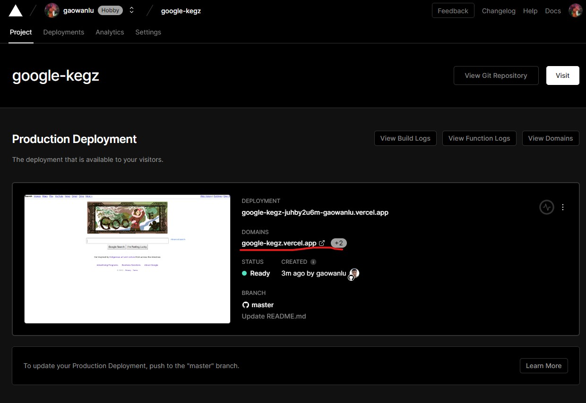

# 10. Configuring Your Own Domain and CNAME:

- Log in to your domain name registrar's account using the provided credentials.
- Locate the domain management or DNS management section within your account settings.
- Access the DNS settings for your domain and find the option to add a new CNAME record.
- Create a new CNAME record by entering the necessary information:
- Enter the subdir or hostname that you want to associate with the CNAME record (e.g., "www"
  for "www.yourdomain.com").
- Specify the canonical name or the target domain that the CNAME record should point to (e.g., "
  your-vercel-project.vercel.app").
- Save the changes to the DNS settings, and the CNAME record will be created and propagated throughout the domain name
  system (DNS) servers.
- Wait for the DNS propagation process to complete, which may take several hours or up to 48 hours in some cases.
- After the DNS propagation is finished, your domain name will be successfully configured, and the CNAME record will
  store incoming requests to the desired destination.

Remember, if you encounter any issues during the process, you can submit an issue or seek assistance from other users on
forums or community platforms. They can provide guidance and help troubleshoot any problems you may encounter.

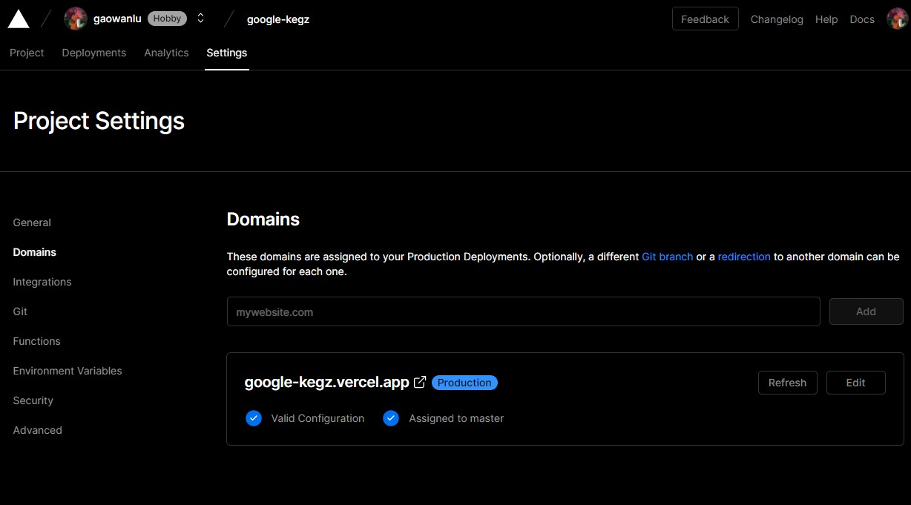
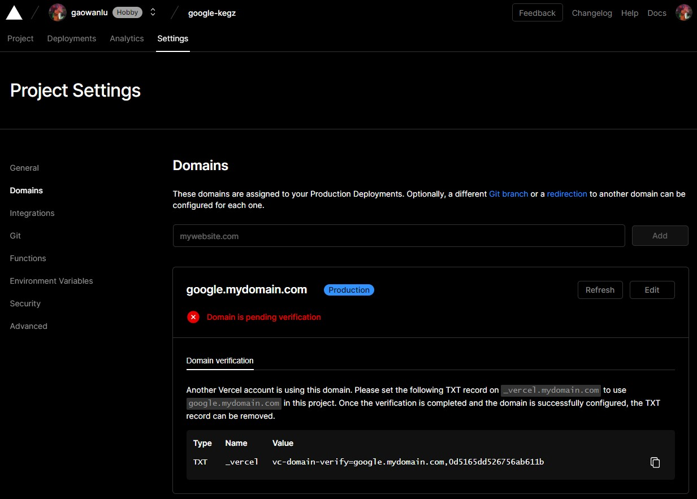

# 11. Configuring Custom Domains:

- On the project settings page, locate the "Domains" or "Custom Domains" section.
- If you haven't added a custom domain before, you will see an option to "Add a Domain." Click on it.
- Enter your domain name in the provided field (e.g., "yourdomain.com") and click on the "Add" or "Save" button.
- Vercel will provide you with DNS configuration instructions specific to your domain registrar. These instructions will
  include details such as DNS records or CNAME settings that need to be added to your domain's DNS settings.

# 12. Adding DNS Records:

- Log in to your domain registrar's account.
- Navigate to the DNS management section or the specific area where you can add DNS records for your domain.
- Follow the instructions provided by Vercel to add the necessary DNS records or CNAME settings. These instructions
  typically involve creating a CNAME record and pointing it to a Vercel-specific domain or project URL.
- Save the DNS record changes on your domain registrar's website.

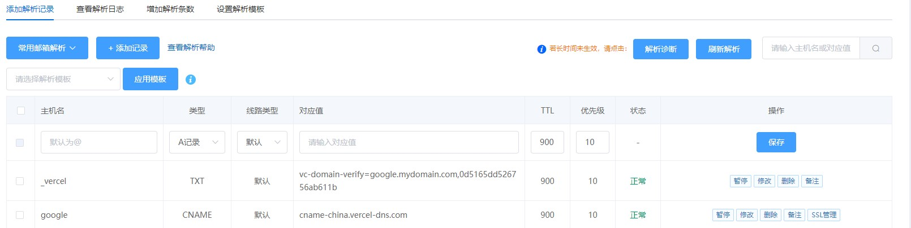

# 13. Verifying Domain Configuration:

- Return to the Vercel dashboard and navigate back to the project's domain settings page.
- Look for an option to verify the domain configuration or check the DNS records.
- Click on the verification option, and Vercel will validate the DNS records and confirm whether the domain is
  configured correctly.

You will be able to manage your domain name on Vercel effectively. This includes configuring custom domains, adding DNS
records, and verifying the domain configuration. With these settings in place, your domain will be correctly linked to
your Vercel project, enabling seamless deployment and hosting on your custom domain.

The TXT record needs to fill in the text provided by vercel above, and the cname is the same

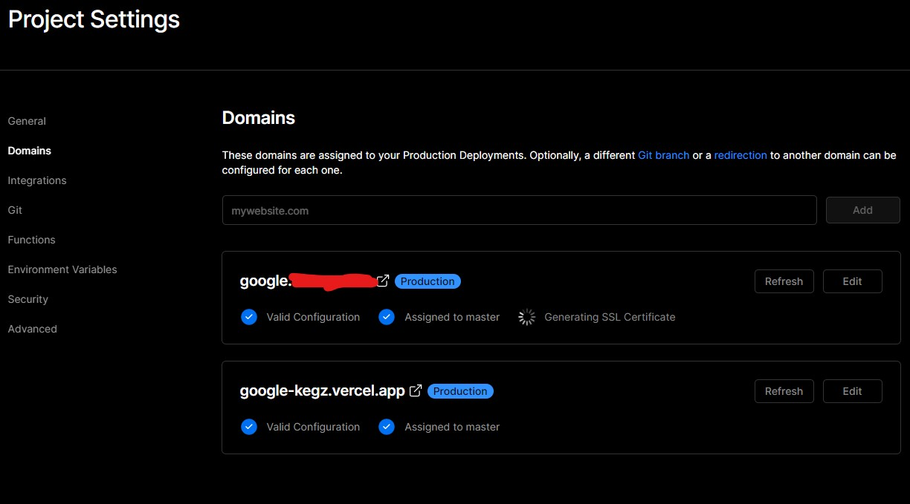

# 14. To modify the default browser engine for your own service and set a custom default:

- Identify the browser engines that are compatible with your service or application. Common browser engines include
  Blink (used by Chromium-based browsers like Google Chrome), Gecko (used by Firefox), and WebKit (used by Safari).
- Consider the specific requirements and compatibility of your service or application with different browser engines.
- Evaluate factors such as performance, rendering capabilities, feature support, and user experience to determine the
  most suitable browser engine for your needs.

`https://google.{{mydomain}}.com`

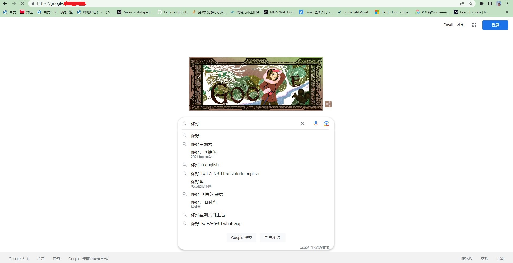

# 15. Implement the Default Browser Engine Modification:

- Access the configuration files or settings of your service or application, which may vary depending on the platform or
  technology stack you are using.
- Locate the section or option related to the default browser engine configuration.
- Modify the configuration to set your desired default browser engine. This may involve specifying the engine's name or
  related settings.
- Deploy or launch your service or application with the modified default browser engine configuration.
- Thoroughly test the functionality, performance, and compatibility of your service across different platforms and
  devices.
- Monitor user feedback and bug reports to ensure that the modified default browser engine performs as expected and
  meets the requirements of your service.
- Consider offering customization options for users to choose their preferred browser engine within your service or
  application.
- Implement a user interface or settings panel where users can select their desired default browser engine.
- Ensure that the chosen browser engine is applied consistently throughout the user's session and saved as their
  preference for future sessions.
-

You can modify the default browser engine for your own service, allowing you to tailor the browsing experience and
optimize compatibility based on your specific requirements. Remember to thoroughly test the changes and consider
providing customization options for user flexibility.

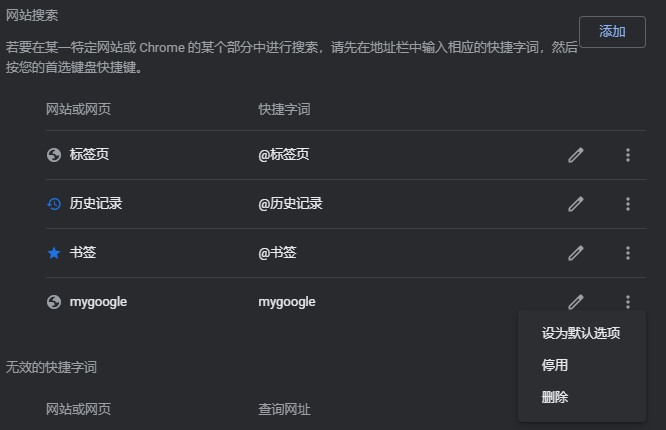

# 16. To change the data center where your service is hosted, which in turn can impact the IP address used for Google Search, follow these expert instructions:

- Research hosting providers that offer data centers in the desired location. Consider factors such as reliability,
  performance, security, and available data center locations.
- Popular hosting providers like Amazon Web Services (AWS), Google Cloud Platform (GCP), Microsoft Azure, and
  DigitalOcean often have multiple data centers across different regions.
- Choose a hosting provider that aligns with your requirements and has a data center in the desired location.
- Sign up for an account with the selected hosting provider if you haven't done so already.
- Follow the hosting provider's documentation or guidelines to set up the infrastructure for your service in the desired
  data center.
- This typically involves creating instances, virtual machines, containers, or other resources needed to run your
  service.
- Update your DNS (Domain Name System) records to point to the IP address associated with the new data center.
- Access your domain registrar or DNS provider's management interface and locate the DNS settings for your domain.
- Update the A or AAAA records (IPv4 or IPv6) with the new IP address provided by the hosting provider.
- Monitor the DNS propagation process, which can take some time to propagate globally (typically a few hours to up to 48
  hours).
- Verify that the new IP address is correctly associated with your domain by performing DNS lookups or using online DNS
  tools.
- Test your service to ensure it is functioning as expected in the new data center. Pay attention to any specific
  configurations or optimizations required for the new environment.

You can change the data center where your service is hosted, potentially affecting the IP address used for Google
Search. Remember to select a hosting provider with the desired data center location, update DNS records accordingly, and
thoroughly validate and test your service in the new environment.


